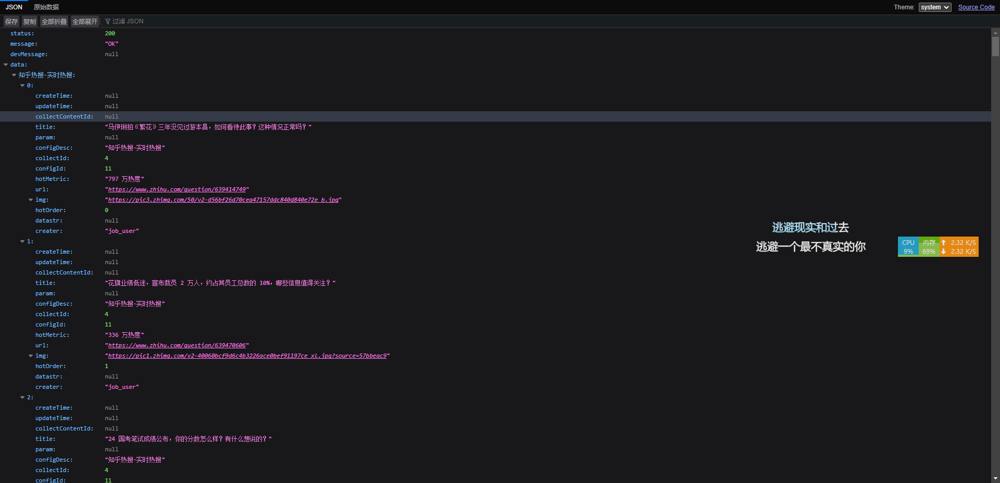

## 本项目仅供个人娱乐使用，请勿做其他用途
> 项目简介
> 实时或定时抓取各网络平台的热搜数据，基于weblogic爬虫框架一个可自定义、可扩展的抓取数据工程；
> 目前已实现，某乎、某音、某度、某博等平台的热搜数据抓取

### 实时接口返回数据如下

### 项目运行
1.新建数据库 hot-search
2.运行init.sql中的脚本
3.启动运行
4.访问接口 http://localhost:8090/hot/search/api/admin/queryRealTime

### 效果展示

### todos

